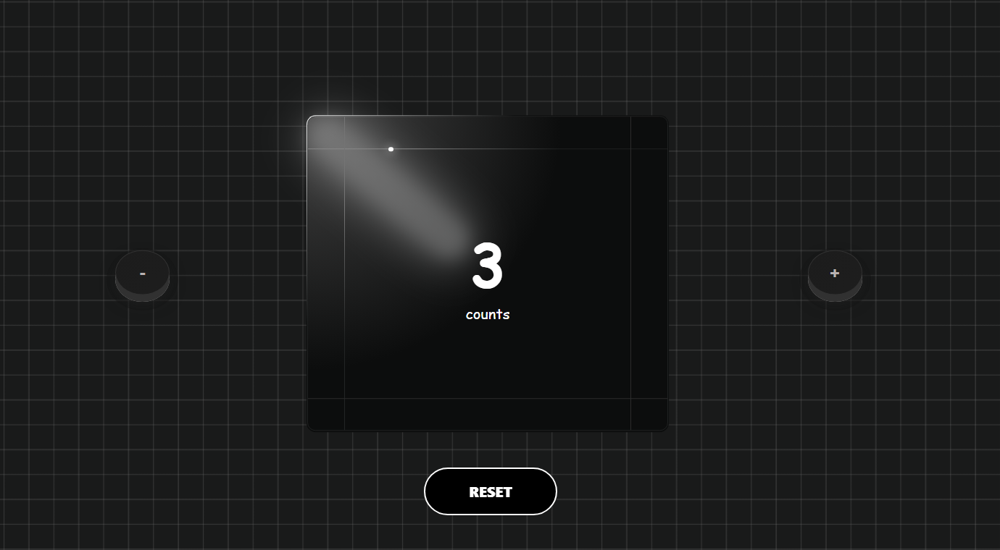

# 🎯 Counter App

A sleek and modern **Counter App** built using **HTML, CSS, and JavaScript**. This project showcases how a simple idea like counting can be turned into an elegant, interactive web application with smooth animations and a beautiful user interface.

## 🚀 Features

- ✅ **Live Counter Display**
- ➕ **Increment**, ➖ **Decrement**, and 🔄 **Reset** buttons
- 💡 **Clean and modern UI**
- 🌀 **Smooth button animations and hover effects**
- 📱 **Fully responsive design** – works on all screen sizes
- ⚙️ **No external libraries** – built with pure HTML, CSS, and JS

## 🛠️ Technologies Used

- **HTML5** – Markup structure  
- **CSS3** – Styling and layout (includes transitions & flexbox)  
- **JavaScript** – DOM manipulation and logic

## 🧩 Folder Structure

counter-app/
│
├── index.html # Main HTML file
├── style.css # Styling file
├── script.js # JavaScript logic
└── screenshot # Preview image for README
